# 프로젝트명 : 붕괴된 마력의 정수 (개발 : 윤홍인)

  

## [목차]
### 1. [컨셉](#1)
### 2. [관련 컨셉 이미지](#2)
### 3. [대표 이미지](#3)
### 4. [작품 묘사](#4)
### 5. [Mirroring 구성 요소](#5)
### 6. [게임 시스템 디자인](#6)
### 7. [개발 요구사항 & 흐름도](#7)
### 8. [스토리보드](#8)
### 9. [프로토타입 개발 요구사항 현황](#9)
### 10. [프로토타입 개발작업 일정 (6주차 개발)](#10)
 

***

  

## [컨셉]
### 메인컨셉 :: 선택
- 단순히 주어진 스킬들을 사용하여 이루어지는 1차원적인 적과의 전투가 아닌 적 쓰러뜨리기 위해 플레이어가 사용할 수 있는 스킬들을 조합하여 강하게 공격하거나 스킬을 조합하지 않고 빠르게 여러 번 공격하는 등, 여러 방식으로 적을 처치할 수 있도록 하여 플레이어에게 주어진 다양한 경우의 수에서 가장 선호하고 원하는 방식을 직접 선택하여 게임을 진행할 수 있게끔 하고자 메인 컨셉을 "선택"으로 정하였습니다.

### 서브 컨셉 1 :: 다양성
- 사용하거나 조합하는 스킬의 종류, 마법 지팡이의 종류, 몬스터의 종류 등을 다양하게 구성하여 플레이어가 경험할 수 있는 플레이의 폭을 넓히고자 첫 번째 서브 컨셉을 "다양성"으로 정하였습니다.

### 서브 컨셉 2 :: 자유
- 플레이어는 적과의 전투, 게임의 진행에 있어서 방식이나 내용에 크게 구애받지 않고 플레이어가 원하는 방식으로 진행할 수 있게끔 하고자 두 번째 서브 컨셉을 "자유"로 정하였습니다.

### 서브 컨셉 3 :: 조합
- 앞써 말씀드린 다양한 스킬들과 마법 지팡이들 중 플레이어가 원하는 스킬과 장비를 자유롭게 선택하여 플레이하게끔 하고자 세 번째 서브 컨셉을 "조합"으로 정하였습니다.

  

## [관련 컨셉 이미지]

  

## [대표 이미지]

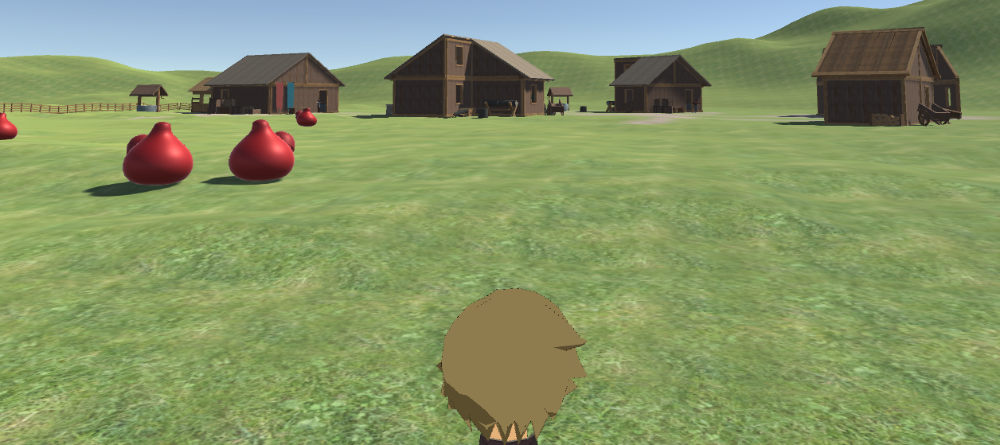

  

## [작품묘사]

> ### 시작 화면 :
> - 광활한 숲을 배경으로 공중에 보라색 크리스탈의 마력의 정수가 붕괴되고 있는 이미지를 채택하여, 게임의 컨셉인 자유와 장르인 어드벤쳐를 표현할 수 있도록 구상했습니다.
> - 좌측 하단에는 게임을 시작하는 버튼과 게임을 종료하는 버튼 그리고 설정 버튼을 두어 사용자의 선택에 의해 게임을 설정하거나 시작할 수 있도록 구상했습니다.

 

> ### 게임 화면 :
> - 전체적으로 UI를 최소화하여 사용자가 게임의 상황에 쉽게 몰입할 수 있는 환경을 조성하였습니다.
> - 좌측 단에 현재 플레이어 레벨과 플레이어가 소지한 재화를 확인할 수 있도록 UI를 배치하였습니다.
> - 'ESC'키를 이용하여 사용자 메뉴를 이용할 수 있도록 구상했습니다.
> - 마우스를 이용하여 플레이어 캐릭터의 시아를 변경하며, 'F'키를 이용해 사물 및 NPC와 상호작용 할 수 있습니다.

 

### 시나리오 :

> 어느 날 세계의 곳곳에서 마력의 균형을 유지하는 마력의 정수가 알 수 없는 원인으로 갑자기 붕괴하기 시작합니다.

> 이로 인해 마법의 위력이 비정상적으로 강해져 마물(몬스터)들이 활개를 치고, 마법의 영향을 받는 공간이 뒤틀리는 등, 다양한 문제가 발생하게 됩니다.

> 세계의 변두리, 작은 마을에서 마을 사람들을 도와주던 젊은 마법사 그리우스는 세계에 이상을 느끼고 원인을 알아내 문제를 해결하기위한 모험을 떠나게 됩니다.

> 난폭해진 마물들을 처치하여 위험에 노출된 마을들을 구하면서 원인을 찾던 중, 마력의 정수가 붕괴하기 시작한 원인에 연금술사들이 관여하고 있다는 것을 알게 됩니다.

> 그리우스가 마물들과 연금술사들을 처치하며, 마력의 정수에 가까워질수록 그의 앞을 막는 연금술사들이 더욱 강력해지고 많아졌습니다. 그는 강력한 연금술사들을 쓰러뜨리며, 마력의 정수를 하나씩 원래대로 되돌려 놓았습니다.

> 그리우스가 마지막 마력의 정수에 이르렀을 때, 그의 앞에 연금술사 협회장이 모습을 드러냈습니다. 그리고 연금술사 협회장이 기술 발전을 위해 마력의 정수를 이용하려고 했고 이로 인해 마력의 정수가 붕괴되기 시작했다는 것을 알게 되었습니다.

> 그리우스는 마력의 균형을 되돌리기 위해 연금술사 협회장을 쓰러뜨리고 마력의 정수를 되돌립니다. 세계는 다시 균형을 찾고 평화로워지며 게임은 끝을 맺습니다.

  

## [Mirroring의 구성 요소]
### 1. 메커니즘

[도전 과제]

1. 마을 주변 필드의 마물(몬스터)처치 및 마을 여관 퀘스트 클리어를 통하여 경험치와 재화 획득을 하여 상위 단계의 마법을 습득하고 강한 장비를 구매로 캐릭터 육성 및 스토리 진행.

2. 최종 스테이지를 클리어하고 스토리의 결말 및 게임 클리어.

[재미 요소]

1. 스토리 : 플레이어가 캐릭터를 육성하고 게임을 계속 진행해야 하는 이유와 동기를 부여함으로써 플레이어가 게임에 자발적으로 참여하게 만듦.

2. 필드(마을, 숲) : 스토리의 틀과 개연성을 제공하고 플레이어가 캐릭터를 육성하고 스토리를 직접 이끌어 나가는 공간으로 사용되어 게임과 스토리에 직접적으로 참여할 수 있도록 연결하는 장치로서 작용함.

3. 스킬 : 다양한 스킬들을 사용하거나 조합하고 새로운 스킬들을 얻어 마물(몬스터)을 처치할 수 있도록 하여 플레이어가 캐릭터를 육성하고 퀘스트를 클리어 하는데 있어서 흥미를 자아낼 수 있는 장치로서 작용함.

4. 아이템 : 플레이어가 스테이지를 클리어하는데 도움 혹은 기믹으로 작용하여, 단순한 게임플레이 방식에서 탈피하고 마물(몬스터)의 능력치로 게임 난이도를 조절하는 것이 아닌 기믹을 통해 난이도를 조절함으로써 스토리 진행에 플레이어가 더 직접적으로 참여하게 함.

 

### 2. 이야기

[만들게 된 배경]

개인주의적 성향이 유행하고 있는 현재 사회에서 개인주의와 이기주의를
혼동하여 살아가는 사람들이 많아지고 있고 개인주의와 이기주의의 측면으로
접근하지 않더라도 사회적 동물로써 상호관계 간 최소한의 배려 및 존중조차
하지 않는 잘못된 이념이 문제없이 적용되고 있는 단체들이 존재한다.
주변에서 흔하게 볼 수 있는 예시로써 왕따 문제가 있다.
우리는 게임을 통해 원활하고 완만한 인간관계가 서로 간의 존중과
배려에서 비롯하고 자신의 사소한 행동이 때로는 상대방에서 정신적,
신체적으로 크게 영향을 끼칠 수 있다는 경각심을 게임을 통해 상기시키고자
한다.

[참신함]

- 주변에서 실제로 일어나고 있는 사회적 문제를 주제로 하여
플레이어에게 문제의식을 상기시킴.

- 스스로의 행동에 대하여 성찰하는 기회를 제공하여
게임의 의미와 깊이를 더함

[카메라 관점]  

1. 1인칭 시점을 채택하여 플레이어에게 몰입감과 현실감을 제공함.
2. 화면 UI를 간소화하여 플레이어가 게임 속 상황에 몰입할 수 있는 환경을 제공함.
3. 좌측 하단에 플레이어가 획득한 아이템을 아이콘으로 보여주어 시각적으로 확인할 수 있도록 함.

 

### 3. 미적요소

[디자인]

캐릭터 : 주변에서 볼 수 있는 건장한 20대 남성의 모델을 사용.

오브젝트 : 현실에 실제로 존재할 것 같은 디자인의 물건(책장, 탁자, 액자, 시계) 모델을 사용.

상호작용 : 물체들의 중력작용과 캐릭터의 움직임 등이 현실성 있게 작용하여 실제처럼 구현.

[컬러]

캐릭터 : 대한민국 20대 남성을 모티브로 하고 있으므로 살구색 피부의 검정머리 남성으로 구현.

오브젝트 및 주변환경 : 허름한 집, 정리가 안된 창고의 분위기를 자아내기 위해 어둡고 얼룩진 색상으로 표현.

[음향]  

캐릭터 : 걷거나 상호작용할 때, 무겁고 둔탁한 음향을 사용하여 으스스한 분위기 조성.

오브젝트 및 주변환경 : 바람이 새는 소리와 물건이 떨어지는 소리, 문이 천천히 열리는 소리 등 으스스한 분위기를 조성할 수 있는 음향을 활용.

 

### 4. 기술

1. 물체의 상호작용에 물리엔진을 적용하여 현실적인 물체의 움직임을 구현.
2. 음향의 싱크를 맞춰 캐릭터와 물체의 움직임에 현실성을 더함.

  

## [게임 시스템 디자인]

### 1. 게임 오브젝트 분해

|번호|오브젝트 이름(영문이름)|이미지|
|:---:|:---:|:---:|
|1|AdmissionPhoto||
|2|GraduatePhoto||
|3|Bed||
|4|MagicMirror||
|5|Drawer_1, Drawer_2||
|6|PictureOfPiano||
|7|HintPaper|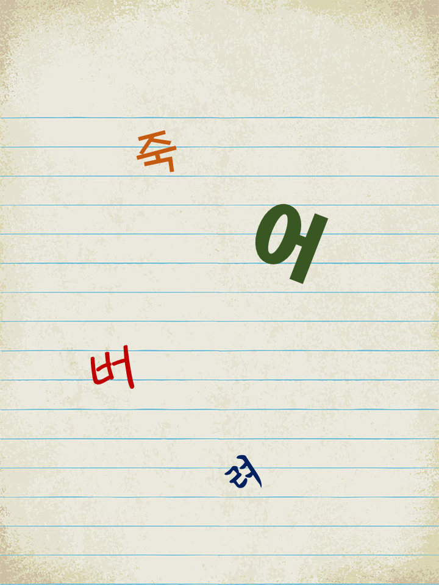|
|8|Table||
|9|Safe_1, Safe_2||
|10|BookShelf_1, BookShelf_2||
|11|LittleBox||
|12|Diary_1, Diary_2, Diary_3, Diary_4, Diary_5, Diary_6|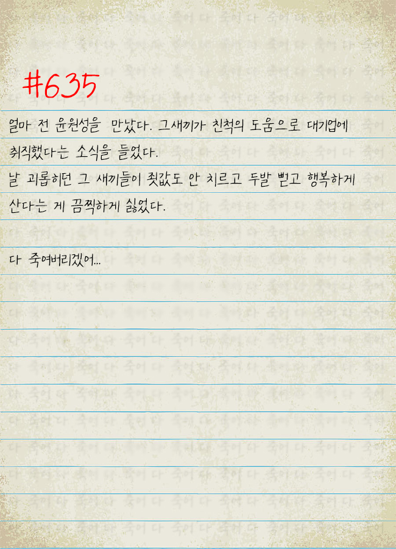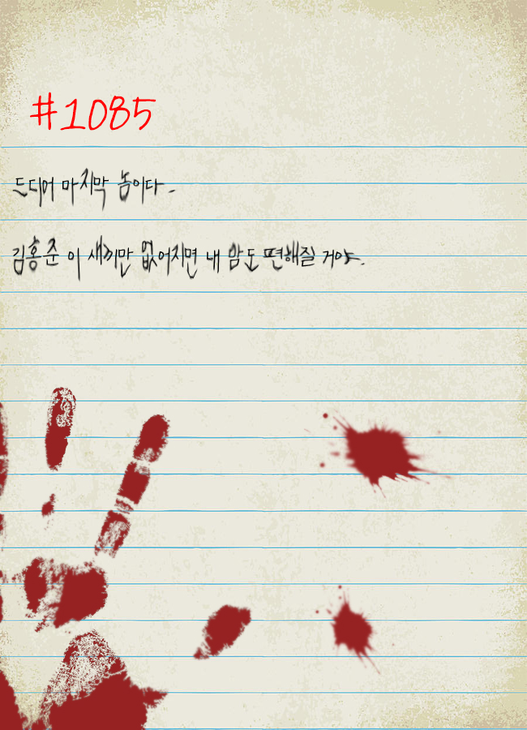|
|13|AlbumOfGraduation||
|14|Frame||
|15|KeyOfDrawer_1, KeyOfDrawer_2, RoomKey||
|16|Door, IronDoor||
|17|Compass||
|18|Sofa||
|19|Newspaper|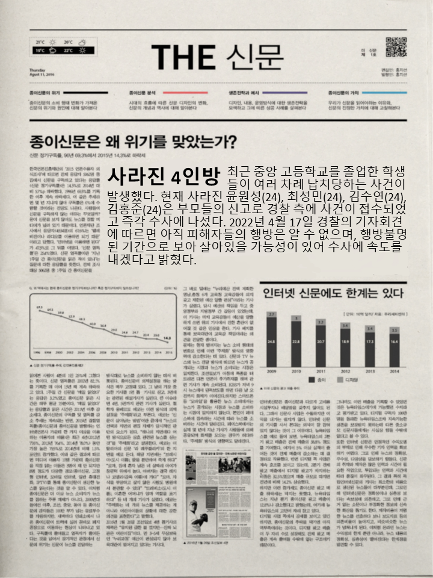|
|20|QuestionPaper|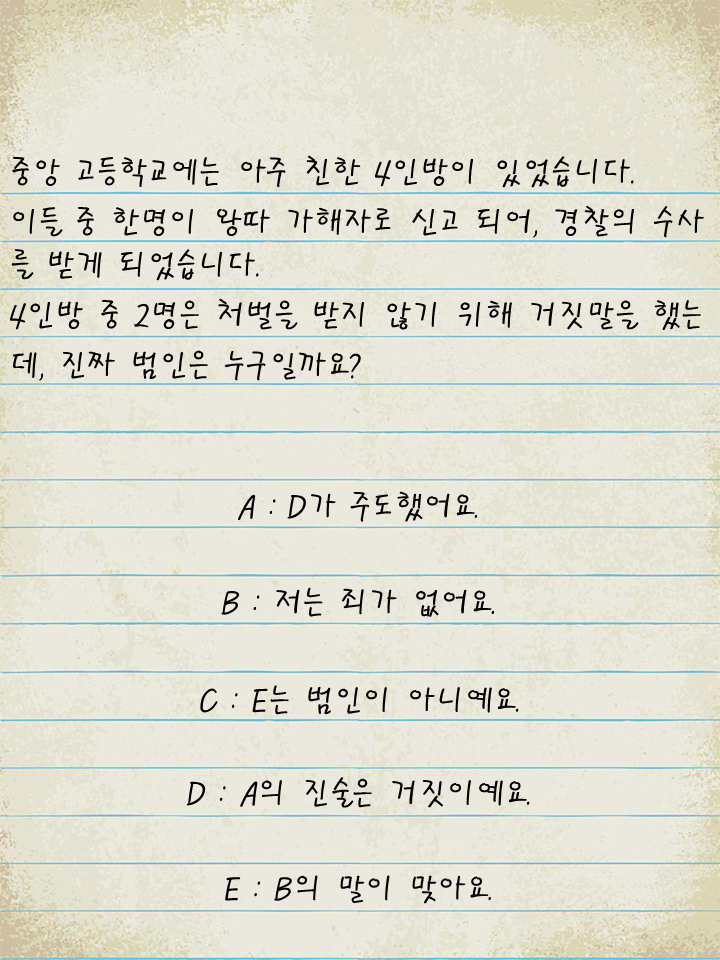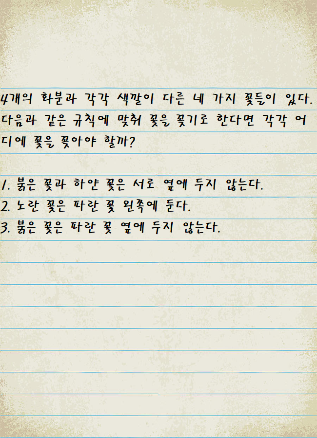|
|21|DeadBodyCloth|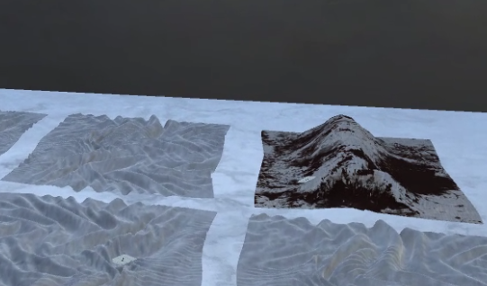|
|22|Vase|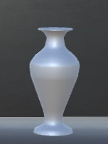|
|24|Flower||
|25|NPC|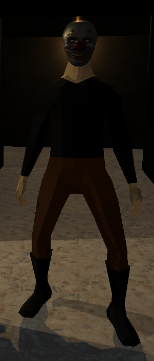|

 

***

 

### 2. 플레이어 캐릭터 속성 (파라미터)

|속성|영문 명칭|설명|비고|
|:---:|:---:|:---:|:---:|
|캐릭터 이동속도|playerSpeed|플레이어 캐릭터의 이동속도 값을 설정합니다.||
|카메라 회전속도|playerXRotateSpeed|플레이어의 카메라 회전속도 값을 설정합니다.||
|소지품|Items|플레이어가 소지한 아이템의 리스트를 저장합니다.||
|클리어 스테이지|Clear Stage|플레이어가 클리어한 있는 스테이지를 저장합니다.||
|클리어 확인|Clear Check|플레이어가 현재 진행하고 있는 스테이지의 목표를 달성했는지 확인합니다.||

 

***

 

### 3. 오브젝트 속성 (파라미터)

#### 1) 오브젝트 이름 : 문 Door

|속성|영문 명칭|설명|비고|
|:---:|:---:|:---:|:---:|
|잠금 확인|OpenDoor|문이 현재 열 수 있는 상태인지 확인합니다.||

#### 2) 오브젝트 이름 : 금고 Safe

|속성|영문 명칭|설명|비고|
|:---:|:---:|:---:|:---:|
|잠금 확인|OpenSafe|금고가 현재 열 수 있는 상태인지 확인합니다.||

#### 3) 오브젝트 이름 : 책상 Table

|속성|영문 명칭|설명|비고|
|:---:|:---:|:---:|:---:|
|잠금 확인|OpenTable|책상의 서랍이 현재 열 수 있는 상태인지 확인합니다.|열쇠가 필요한 책상 서랍과 필요 없는 책상 서랍이 있습니다.|

#### 4) 오브젝트 이름 : 서랍 Drawer

|속성|영문 명칭|설명|비고|
|:---:|:---:|:---:|:---:|
|잠금 확인|OpenDrawer|서랍이 현재 열 수 있는 상태인지 확인합니다.|열쇠가 필요한 서랍과 필요 없는 서랍이 있습니다.|

#### 5) 오브젝트 이름 : 액자 Frame

|속성|영문 명칭|설명|비고|
|:---:|:---:|:---:|:---:|
|낙하 확인|DropCheck|액자와의 상호작용 여부를 저장합니다.|액자는 최초 1회만 상호작용하는 오브젝트입니다.|

#### 6) 오브젝트 이름 : 화병 Vase

|속성|영문 명칭|설명|비고|
|:---:|:---:|:---:|:---:|
|꽃 획득 확인|FlowerGetCheck|꽃 오브젝트와의 상호작용 여부를 저장합니다.|플레이어는 한 번에 하나의 꽃만 가지고 있을 수 있습니다.|
|화병 상호작용 확인|VaseTakeCheck|꽃을 화병에 꽂은 횟수를 저장합니다.|화병과 4번의 상호작용이 일어났는지 확인합니다.|
|정답 횟수 확인|AnswerCheck|꽃을 올바르게 화병에 꽂았는지 확인합니다.|4개의 화병에 모두 올바르게 꽃을 꽂았는지 확인합니다.|

 

***

 

### 4. 플레이어 캐릭터의 행동

|행동|영문 명칭|설명|
|:---:|:---:|:---:|
|앞으로 이동|Walk_Forward|플레이어 캐릭터를 앞으로 이동합니다.|
|뒤로 이동|Walk_Back|플레이어 캐릭터를 뒤로 이동합니다.|
|오른쪽으로 이동|Walk_Right|플레이어 캐릭터를 오른쪽으로 이동합니다.|
|왼쪽으로 이동|Walk_Left|플레이어 캐릭터를 왼쪽으로 이동합니다.|
|상호작용 하기|Interaction|'F'키를 눌러 게임 오브젝트와 상호작용합니다.|
|시아 변경|Looking|마우스를 이용하여 시아를 변경합니다.|

 

***

 

### 5. 게임 오브젝트의 행동

#### 1) 오브젝트 이름 : 첫 번째 방의 문 Door

|행동|영문 명칭|설명|
|:---:|:---:|:---:|
|열쇠 확인|DoorKeyCheck|플레이어가 열쇠를 가지고 있는지 확인하고 OpenDoor의 값을 수정합니다.|

#### 2) 오브젝트 이름 : 두 번째 방의 문 IronDoor

|행동|영문 명칭|설명|
|:---:|:---:|:---:|
|비밀번호 확인|DoorOpenCheck|플레이어가 입력한 비밀번호가 옳은지 확인하고 OpenDoor의 값을 수정합니다.|

#### 3) 오브젝트 이름 : 금고 Safe

|행동|영문 명칭|설명|
|:---:|:---:|:---:|
|비밀번호 확인|PasswordCheck|플레이어가 입력한 비밀번호가 옳은지 확인하고 OpenSafe의 값을 수정합니다.|

#### 4) 오브젝트 이름 : 책상 Table

|행동|영문 명칭|설명|
|:---:|:---:|:---:|
|열쇠 확인|TableKeyCheck|플레이어가 열쇠를 가지고 있는지 확인하고 OpenTable의 값을 수정합니다.|

#### 5) 오브젝트 이름 : 서랍 Drawer

|행동|영문 명칭|설명|
|열쇠 확인|DrawerKeyCheck|플레이어가 열쇠를 가지고 있는지 확인하고 OpenDrawer의 값을 수정합니다.|

#### 6) 오브젝트 이름 : 액자 Frame

|행동|영문 명칭|설명|
|:---:|:---:|:---:|
|상호작용 확인|InteractionCheck|DropCheck의 값을 확인하고 액자와 상호작용합니다.|

#### 7) 오브젝트 이름 : 열쇠 Key

|행동|영문 명칭|설명|
|:---:|:---:|:---:|
|획득 확인|GetKey|열쇠 오브젝트를 게임에서 비활성화하고 플레이어의 소지품 리스트에 추가합니다.|

#### 8) 오브젝트 이름 : 종이 및 사진 오브젝트 Paper or Picture Items

|행동|영문 명칭|설명|
|:---:|:---:|:---:|
|상호작용 확인|InteractionCheck|해당 물체와 상호작용 하였을 때, 해당 종이 또는 사진이 플레이어의 화면에 확대되어 표출되도록 합니다.|

#### 9) 오브젝트 이름 : 소파 Sofa

|행동|영문 명칭|설명|
|:---:|:---:|:---:|
|상호작용 확인|InteractionCheck|해당 물체와 상호작용 하였을 때, 해당 물체의 위치가 이동하도록 합니다.|

#### 10) 오브젝트 이름 : 첫 번째 방의 책장 First Room BookShelf

|행동|영문 명칭|설명|
|:---:|:---:|:---:|
|상호작용 확인|InteractionCheck|해당 물체와 상호작용 하였을 때, 책장 안의 책이 나오고 플레이어 화면에 일기장 이미지가 확대되어 표출되도록 합니다.|

#### 11) 오브젝트 이름 : 두 번째 방의 책장 Second Room BookShelf

|행동|영문 명칭|설명|
|:---:|:---:|:---:|
|상호작용 확인|InteractionCheck|해당 물체와 상호작용 하였을 때, 일정 횟수 동안 주인공의 대사가 나오고 이후 책장의 위치가 이동하도록 합니다.|

#### 12) 오브젝트 이름 : 꽃 Flower

|행동|영문 명칭|설명|
|:---:|:---:|:---:|
|상호작용 확인|InteractionCheck|해당 물체와 상호작용 하였을 때, 해당 오브젝트가 비활성화 되고 사용자의 인벤토리 UI에 꽃 이미지를 활성화합니다.|

#### 13) 오브젝트 이름 : 화병 Vase

|행동|영문 명칭|설명|
|:---:|:---:|:---:|
|상호작용 확인|InteractionCheck|플레이어가 꽃 아이템을 소지하고 있는 상태에서 해당 물체와 상호작용 하였을 때, 해당 꽃의 오브젝트가 화병에 놓이게 됩니다.|
|정답 확인|AnswerCheck|플레이어가 꽂은 꽃이 해당 화병에 알맞은 꽃인지 확인하여 모든 화병에 알맞은 꽃을 꽂았을 경우, 복도의 문이 열립니다.|

 

***

 

### 6. 플레이어 캐릭터의 상태

|현상태|전이상태|전이조건|
|:---:|:---:|:---:|
|기본 상태(Idle)||아무것도 하지 않은 기본 상태 입니다.|
|모든 상태 중(예외. 상호작용 중)|앞으로 이동합니다.|'W'키를 누릅니다.|
|모든 상태 중(예외. 상호작용 중)|뒤로 이동합니다.|'S'키를 누릅니다.|
|모든 상태 중(예외. 상호작용 중)|오른쪽으로 이동합니다.|'D'키를 누릅니다.|
|모든 상태 중(예외. 상호작용 중)|왼쪽으로 이동합니다.|'A'키를 누릅니다.|
|모든 상태 중(예외. 상호작용 중)|플레이어의 시아를 변경합니다.|마우스를 움직입니다.|
|모든 상태 중|Ray에 맞은 오브젝트와 상호작용합니다.|상호작용 하고자하는 오브젝트에 CrossHair를 두고 'F'키를 누릅니다.|

 

***

 

### 7. 게임 오브젝트의 상태

#### 1) 오브젝트 이름 : 첫번째 방의 문 Door

|현상태|전이상태|전이조건|
|:---:|:---:|:---:|
|기본 상태(잠김 상태)||아무것도 하지 않은 기본 상태 입니다.|
|기본 상태(잠김 상태)|열쇠가 필요하다는 내용의 자막을 표출합니다.|문의 열쇠가 없는 상태에서 문과 상호작용합니다.|
|기본 상태(잠김 상태)|열림 상태|문의 열쇠를 소지한 상태에서 문과 상호작용합니다.|
|열림 상태|기본 상태(잠김 상태)|문이 열려있는 상태에서 문과 상호작용합니다.|

#### 2) 오브젝트 이름 : 두번째 방의 문 IronDoor

|현상태|전이상태|전이조건|
|:---:|:---:|:---:|
|기본 상태(잠김 상태)||아무것도 하지 않은 기본 상태 입니다.|
|기본 상태(잠김 상태)|비밀번호가 맞지 않다는 내용의 자막을 표출합니다.|문의 비밀번호를 틀립니다.|
|기본 상태(잠김 상태)|열림 상태|문의 비밀번호를 맞춥니다.|
|열림 상태|기본 상태(잠김 상태)|문이 열려있는 상태에서 문과 상호작용합니다.|

#### 3) 오브젝트 이름 : 금고 Safe

|현상태|전이상태|전이조건|
|:---:|:---:|:---:|
|기본 상태(잠김 상태)||아무것도 하지 않은 기본 상태 입니다.|
|기본 상태(잠김 상태)|비밀번호가 맞지 않다는 내용의 자막을 표출합니다.|금고의 비밀번호를 틀립니다.|
|기본 상태(잠김 상태)|열림 상태|금고의 비밀번호를 맞춥니다.|

#### 4) 오브젝트 이름 : 책상 Table

|현상태|전이상태|전이조건|
|:---:|:---:|:---:|
|기본 상태(잠김 상태)||아무것도 하지 않은 기본 상태 입니다.|
|기본 상태(잠김 상태)|열쇠가 필요하다는 내용의 자막을 표출합니다.|책상서랍의 열쇠가 없는 상태에서 책상과 상호작용합니다.|
|기본 상태(잠김 상태)|열림 상태|책상서랍의 열쇠를 소지한 상태에서 책상과 상호작용합니다.|

#### 5) 오브젝트 이름 : 서랍 Drawer

|현상태|전이상태|전이조건|
|:---:|:---:|:---:|
|기본 상태(잠김 상태)||아무것도 하지 않은 기본 상태 입니다.|
|기본 상태(잠김 상태)|열쇠가 필요하다는 내용의 자막을 표출합니다.|서랍의 열쇠가 없는 상태에서 서랍과 상호작용합니다.|
|기본 상태(잠김 상태)|열림 상태|서랍의 열쇠를 소지한 상태에서 과 상호작용합니다.|

#### 6) 오브젝트 이름 : 액자 Frame

|현상태|전이상태|전이조건|
|:---:|:---:|:---:|
|기본 상태(Idle)||아무것도 하지 않은 기본 상태 입니다.|
|기본 상태(Idle)|떨어짐 상태|액자와 상호작용 합니다.|

#### 7) 오브젝트 이름 : 열쇠 Key

|현상태|전이상태|전이조건|
|:---:|:---:|:---:|
|기본 상태(Idle)||아무것도 하지 않은 기본 상태 입니다.|
|기본 상태(Idle)|플레이어가 획득한 상태(열쇠 오브젝트를 비활성화 합니다.)|열쇠와 상호작용 합니다.|

#### 8) 오브젝트 이름 : 종이 및 사진 아이템 Paper or Picture Items

|현상태|전이상태|전이조건|
|:---:|:---:|:---:|
|기본 상태(Idle)||아무것도 하지 않은 기본 상태 입니다.|
|기본 상태(Idle)|플레이어와 상호작용 중인 상태|해당 오브젝트와 상호작용 합니다.|

#### 9) 오브젝트 이름 : 소파 sofa

|현상태|전이상태|전이조건|
|:---:|:---:|:---:|
|기본 상태(Idle)||아무것도 하지 않은 기본 상태 입니다.|
|기본 상태(Idle)|플레이어와 상호작용 중인 상태|해당 오브젝트가 이동합니다.|

#### 10) 오브젝트 이름 : 첫 번째 방의 책장 First Room BookShelf

|현상태|전이상태|전이조건|
|:---:|:---:|:---:|
|기본 상태(Idle)||아무것도 하지 않은 기본 상태 입니다.|
|기본 상태(Idle)|플레이어와 상호작용 중인 상태|해당 오브젝트와 상호작용 합니다.|

#### 11) 오브젝트 이름 : 두 번째 방의 책장 Second Room BookShelf

|현상태|전이상태|전이조건|
|:---:|:---:|:---:|
|기본 상태(Idle)||아무것도 하지 않은 기본 상태 입니다.|
|기본 상태(Idle)|플레이어와 첫 번째부터 세 번째 상호작용 중인 상태|플레이어의 화면 하단 중앙에 자막을 표출합니다.|
|기본 상태(Idle)|플레이어와 네 번째 상호작용 중인 상태|해당 오브젝트가 이동합니다.|

#### 12) 오브젝트 이름 : 꽃 Flower

|현상태|전이상태|전이조건|
|:---:|:---:|:---:|
|기본 상태(Idle)||아무것도 하지 않은 기본 상태 입니다.|
|기본 상태(Idle)|플레이어와 상호작용 중인 상태|해당 오브젝트가 비활성화되고 플레이어 화면 좌측 하단에 꽃 이미지가 활성화됩니다.|
|꽃과 상호작용을 한 상태|화병과 상호작용 중인 상태|플레이어 화면 좌측 하단에 꽃 이미지가 비활성화 됩니다.|

#### 13) 오브젝트 이름 : 화병 Vase

|현상태|전이상태|전이조건|
|:---:|:---:|:---:|
|기본 상태(Idle)||아무것도 하지 않은 기본 상태 입니다.|
|기본 상태(Idle)|플레이어와 상호작용 중인 상태|아무런 반응을 하지 않습니다.|
|꽃과 상호작용을 한 상태|화병과 상호작용 중인 상태|화병에 플레이어가 상호작용한 꽃의 오브젝트가 활성화됩니다.|
|꽃을 알맞지 않게 모두 꽂은 상태|초기화 상태|꽂은 꽃이 화병에 알맞지 않게 되어 화병과 꽃면 초기화됩니다.|
|꽃을 알맞게 모두 꽂은 상태|게임 클리어 상태|게임의 모든 문제를 해결하여 게임이 클리어됩니다.|

 

***

 

### 8. 게임의 규칙

#### 1) 핵심 규칙

- 플레이어는 모든 스테이지의 문을 열고 탈출하면 게임이 클리어됩니다.
- 게임이 전달하고자하는 의미는 플레이어가 스테이지 내에 있는 힌트를 통하여 파악해야 합니다.

#### 2) 보조 규칙

- 게임은 각 방을 하나의 스테이지로 합니다.
- 게임은 플레이어가 어떤 오브젝트와 상호작용이 가능한지 알려주지 않고 플레이어가 직접 스테이지를 돌아다니며 상호작용이 가능한지 확인하며 힌트와 문제를 발견해야 합니다.
- 플레이어는 스테이지 안에서 오브젝트와 상호작용하여 힌트 및 문제를 발견해야 합니다.
- 플레이어는 발견한 힌트를 이용하여 문제를 풀고 문의 열쇠를 얻어야 합니다.
- 플레이어는 문의 열쇠를 획득하면 해당 스테이지의 방문을 열고 다음 스테이지를 진행할 수 있습니다.
- 스테이지 클리어를 위한 문제에 힌트를 주는 스토리와 게임의 의미를 파악하기 위한 스토리가 있습니다.
- 이전 스테이지에서 발견한 힌트는 이후 스테이지에서 활용될 수 있습니다.

 

***

 

### 9. 게임에서 사용될 공식

- 플레이어는 'W', 'A', 'S', 'D'키를 통하여 캐릭터를 이동 시킬 수 있습니다.
- 플레이어는 'F'키를 통하여 스테이지 내의 오브젝트와 상호작용 할 수 있습니다.
- 플레이어는 마우스를 통하여 캐릭터의 시아를 조정할 수 있습니다.
- 플레이어는 화면 중앙의 CrossHair에 원하는 게임 오브젝트를 가져가는 것으로 상호작용할 오브젝트를 결정할 수 있습니다.
- 획득한 아이템은 화면 좌측 상단에 표시되며, 획득한 아이템은 사용할 수 있습니다.

  

## [개발 요구사항 & 흐름도]

### 1. 요구사항

- 시작화면, 메뉴화면, 게임화면으로 총 3개의 화면으로 구성되어 있습니다.
- 시작화면에는 대표 이미지와 화면 중앙에 게임의 타이틀이 적혀 있고 화면 중앙 하단에는 "Press Any Key"의 문구가 적혀 있습니다.
- 시작화면에서 'Esc'키를 누르면 메뉴화면이 활성화 됩니다.
- 메뉴화면에는 게임새로시작 버튼과 게임저장 버튼, 게임종료으로 총 3개의 버튼으로 구성되어 있습니다.
- 메뉴화면에는 게임 내에서 나오는 소리의 음량을 조절할 수 있는 슬라이더가 있습니다.
- 메뉴화면에서 게임새로시작 버튼을 누를 경우, 현재까지 저장하였던 게임의 내용이 지워지고 처음부터 다시할 수 있게 됩니다.
- 메뉴화면에서 게임저장 버튼을 누를 경우, 현재까지 진행하였던 게임이 저장되어 게임을 재실행하였을 때, 저장한 스테이지부터 다시시작할 수 있습니다.
- 메뉴화면에서 게임종료 버튼을 누를 경우, 게임이 종료됩니다.
- 메뉴화면에서 음량 조절 슬라이더를 움직일 경우, 게임 내에서 나오는 소리의 음량을 조절할 수 있습니다.
- 메뉴화면이 활성화 되어있는 상태에서 'Esc'키를 누를 경우, 메뉴화면이 비활성화 되고 원래의 화면으로 돌아갑니다.
- 시작화면에서 'Esc'키를 제외한 아무키를 누르면 게임화면으로 'FadeIn' 하며 게임이 시작됩니다.
- 게임화면에는 좌측 상단에 소지한 아이템이 표시되고 화면 중앙에 CrossHair가 작고 반투명하게 표시됩니다.
- 플레이어는 게임화면에서 ''W, 'A', 'S', 'D'키를 이용하여 플레이어 캐릭터를 조종할 수 있습니다.
- 플레이어는 게임화면에서 마우스를 이용하여 플레이어 캐릭터의 시아를 조종할 수 있습니다.
- 플레이어는 게임화면에서 마우스를 통해 CrossHair를 상호작용하고 싶은 오브젝트에 가져가 'F'키를 누르는 것으로 게임 내의 오브젝트와 상호작용할 수 있습니다.
- 서랍, 책상서랍, 상자와 같은 오브젝트는 열쇠가 있어야 상호작용할 수 있고 열쇠가 있을 때, 상호작용을 하면 서랍 및 상자가 열립니다.
- 금고, 비밀번호가 있는 문과 같은 오브젝트는 상호작용을 하면 비밀번호를 입력할 수 있는 UI가 화면 중앙에 표시되고 비밀번호가 일치할 경우 금고 및 문이 열립니다.
- 종이, 사진과 같은 오브젝트는 상호작용을 하면 플레이어의 화면 중앙에 해당 종이 및 사진이 확대되어 표시됩니다.
- 액자, 책장과 같은 오브젝트는 상호작용을 하면 액자가 떨어지거나 책장에 있는 졸업앨범이 나오는 등, 형태나 상태가 변합니다.
- 게임 내의 오브젝트는 플레이어와 상호작용시, 효과음을 재생합니다.
- 첫 번째 스테이지는 가정 집의 안방을 모티브로 구현합니다.
- 첫 번째 스테이지에서 필요로하는 오브젝트를 수집 및 제작합니다.
- 첫 번째 스테이지에서 플레이어와 상호작용하는 오브젝트에 기능을 구현합니다.
- 두 번째 스테이지는 취조실을 모티브로 구현 합니다.
- 두 번째 스테이지에서 필요로하는 오브젝트를 수집 및 제작합니다.
- 두 번째 스테이지에서 플레이어와 상호작용하는 오브젝트에 기능을 구현합니다.
- 세 번째 스테이지는 콘크리트가 드러난 복도를 모티브로 구현 합니다.
- 세 번째 스테이지에서 필요로하는 오브젝트를 수집 및 제작합니다.
- 세 번째 스테이지에서 플레이어와 상호작용하는 오브젝트에 기능을 구현합니다.
- 첫 번째 엔딩 분기 스테이지의 구상 및 설계를 합니다.
- 첫 번째 엔딩 분기 스테이지에서 필요로하는 오브젝트를 수집 및 제작합니다.
- 첫 번째 엔딩 분기 스테이지에서 플레이어와 상호작용하는 오브젝트에 기능을 구현합니다.
- 두 번째 엔딩 분기 스테이지의 구상 및 설계를 합니다.
- 두 번째 엔딩 분기 스테이지에서 필요로하는 오브젝트를 수집 및 제작합니다.
- 두 번째 엔딩 분기 스테이지에서 플레이어와 상호작용하는 오브젝트에 기능을 구현합니다.
- 선행 스테이지의 문제 및 힌트를 이용하여 풀어야 하는 문제를 추가 합니다.
- 선행 스테이지의 문제와 다른 방식의 문제를 추가합니다.
- 스테이지의 문을 열쇠를 통해 혹은 비밀번호를 맞추어 열게되면 다음 스테이지를 진행 할 수 있게 됩니다.
- 스테이지를 클리어 하여도 플레이어는 이전 스테이지로 언제든 돌아올 수 있습니다.
- 마지막 스테이지를 클리어하면 엔딩 크레딧이 재생되고 시작화면으로 돌아옵니다.
- NPC 오브젝트를 씬에 추가합니다.
- NPC 오브젝트가 플레이어의 특정 게임 진행 단계에 따라 활성화 되도록 기능을 구현합니다.
- 플레이어가 NPC와 상호작용하는 기능을 구현합니다.
- 게임의 환경 광원 효과를 설정 및 조정합니다.
- 광원 오브젝트 설정 값을 조정 및 수정합니다.
- 게임 오브젝트의 광 반사 효과를 설정 및 조정합니다.
- 추가적인 게임 광원 효과 및 기능을 구현합니다.
- 플레이어 오브젝트의 입력 음향을 설정 및 조정합니다.
- 게임 오브젝트의 출력 음향을 설정 및 조정합니다.
- 중간 보고 전 주변 사람들에게 게임을 배포하여 플레이해보고 받은 피드백을 바탕으로 게임을 다듬습니다.
- 중간 보고 전 게임의 오류 수정 및 변경 사항 적용을 합니다.
- 중간 보고서 작성 및 중간 보고를 합니다.
- 피드백 내용 정리 및 수용을 합니다.
- 사람들에게 ProtoType을 플레이해보고 받은 피드백을 바탕으로 게임을 다듬습니다.
- ProtoType 제작을 마무리하고 오류 및 수정사항을 재검토합니다.
- 최종본 제작을 마무리하고 오류 및 수정사항을 재검토합니다.

 

### 2. 키보드 이벤트 흐름도 Flowchart

  

## [프로토타입 개발 요구사항 현황]

### 1주차

- ~~시작화면에는 대표 이미지와 화면 중앙에 게임의 타이틀이 적혀 있고 화면 중앙 하단에는 "Press Any Key"의 문구가 적혀 있습니다.~~
- ~~시작화면에서 'Esc'키를 제외한 아무키를 누르면 게임화면으로 'FadeIn' 하며 게임이 시작됩니다.~~
- ~~게임화면에는 좌측 하단에 소지한 아이템이 표시되고 화면 중앙에 CrossHair가 작고 반투명하게 표시됩니다.~~
- ~~플레이어는 게임화면에서 ''W, 'A', 'S', 'D'키를 이용하여 플레이어 캐릭터를 조종할 수 있습니다.~~
- ~~플레이어는 게임화면에서 마우스를 이용하여 플레이어 캐릭터의 시아를 조종할 수 있습니다.~~
- ~~플레이어는 게임화면에서 마우스를 통해 CrossHair를 상호작용하고 싶은 오브젝트에 가져가 'F'키를 누르는 것으로 게임 내의 오브젝트와 상호작용할 수 있습니다.~~
- ~~서랍, 책상서랍, 상자와 같은 오브젝트는 열쇠가 있어야 상호작용할 수 있고 열쇠가 있을 때, 상호작용을 하면 서랍 및 상자가 열립니다.~~
- ~~금고, 비밀번호가 있는 문과 같은 오브젝트는 상호작용을 하면 비밀번호를 입력할 수 있는 UI가 화면 중앙에 표시되고 비밀번호가 일치할 경우 금고 및 문이 열립니다.~~
- ~~종이, 사진과 같은 오브젝트는 상호작용을 하면 플레이어의 화면 중앙에 해당 종이 및 사진이 확대되어 표시됩니다.~~
- ~~액자, 책장과 같은 오브젝트는 상호작용을 하면 액자가 떨어지거나 책장에 있는 졸업앨범이 나오는 등, 형태나 상태가 변합니다.~~

### 2주차

- ~~첫번째 스테이지는 가정 집의 안방을 모티브로 합니다.~~
- ~~첫번째 스테이지에서 필요로하는 오브젝트를 수집 및 제작합니다.~~
- ~~첫번째 스테이지에서 플레이어와 상호작용하는 오브젝트에 기능을 구현합니다.~~

### 3주차

- ~~두번째 스테이지는 취조실을 모티브로 구현 합니다.~~
- ~~두번째 스테이지에서 필요로하는 오브젝트를 수집 및 제작합니다.~~
- ~~두번째 스테이지에서 플레이어와 상호작용하는 오브젝트에 기능을 구현합니다.~~

### 4주차

- ~~세번째 스테이지는 콘크리트가 드러난 복도를 모티브로 구현 합니다.~~
- ~~세번째 스테이지에서 필요로하는 오브젝트를 수집 및 제작합니다.~~
- ~~세번째 스테이지에서 플레이어와 상호작용하는 오브젝트에 기능을 구현합니다.~~

### 5주차

- ~~게임 내의 오브젝트는 플레이어와 상호작용시, 효과음을 재생합니다.~~
- ~~스테이지의 문을 열쇠를 통해 혹은 비밀번호를 맞추어 열게되면 다음 스테이지를 진행 할 수 있게 됩니다.~~
- ~~스테이지를 클리어 하여도 플레이어는 이전 스테이지로 언제든 돌아올 수 있습니다.~~

### 6주차

- ~~선행 스테이지의 문제 및 힌트를 이용하여 풀어야 하는 문제를 추가 합니다.~~
- ~~선행 스테이지의 문제와 다른 방식의 문제를 추가합니다.~~
- ~~마지막 스테이지를 클리어하면 엔딩 크레딧이 재생되고 시작화면으로 돌아옵니다.~~

### 7주차

- ~~NPC 오브젝트를 씬에 추가합니다.~~
- ~~NPC 오브젝트가 플레이어의 특정 게임 진행 단계에 따라 활성화 되도록 기능을 구현합니다.~~
- ~~플레이어가 NPC와 상호작용하는 기능을 구현합니다.~~

### 8주차

- ~~게임의 환경 광원 효과를 설정 및 조정합니다.~~
- ~~광원 오브젝트 설정 값을 조정 및 수정합니다.~~
- ~~게임 오브젝트의 광 반사 효과를 설정 및 조정합니다.~~
- ~~추가적인 게임 광원 효과 및 기능을 구현합니다.~~

### 9주차

- ~~플레이어 오브젝트의 입력 음향을 설정 및 조정합니다.~~
- ~~게임 오브젝트의 출력 음향을 설정 및 조정합니다.~~

### 10주차

- ~~두 번째 엔딩 분기 스테이지의 구상 및 설계를 합니다.~~
- ~~두 번째 엔딩 분기 스테이지에서 필요로하는 오브젝트를 수집 및 제작합니다.~~
- ~~두 번째 엔딩 분기 스테이지에서 플레이어와 상호작용하는 오브젝트에 기능을 구현합니다.~~

### 11주차

- 10주차와 동일

### 12주차

- ~~중간 보고 전 주변 사람들에게 게임을 배포하여 플레이해보고 받은 피드백을 바탕으로 게임을 다듬습니다.~~

### 13주차

- ~~중간 보고 전 게임의 오류 수정 및 변경 사항 적용을 합니다.~~

### 14주차

- ~~중간 보고 전 게임의 오류 수정 및 변경 사항 적용을 합니다.~~
- 중간 보고서 작성 및 중간 보고를 합니다.
- 피드백 내용 정리 및 수용을 합니다.

  

## [프로토타입 개발작업 일정]

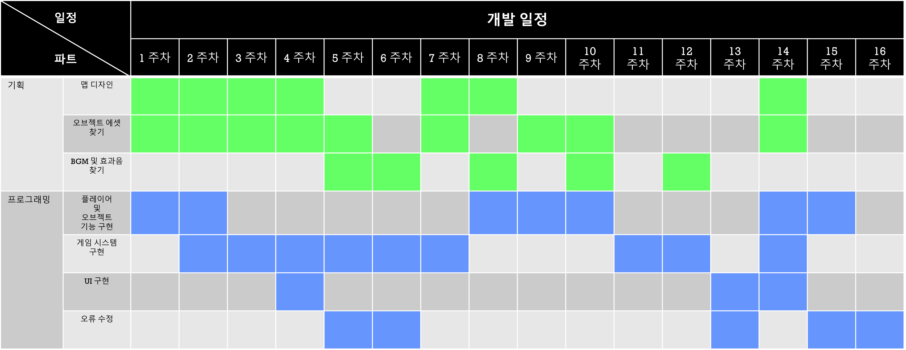
