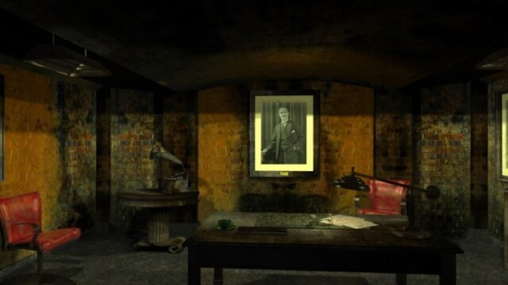
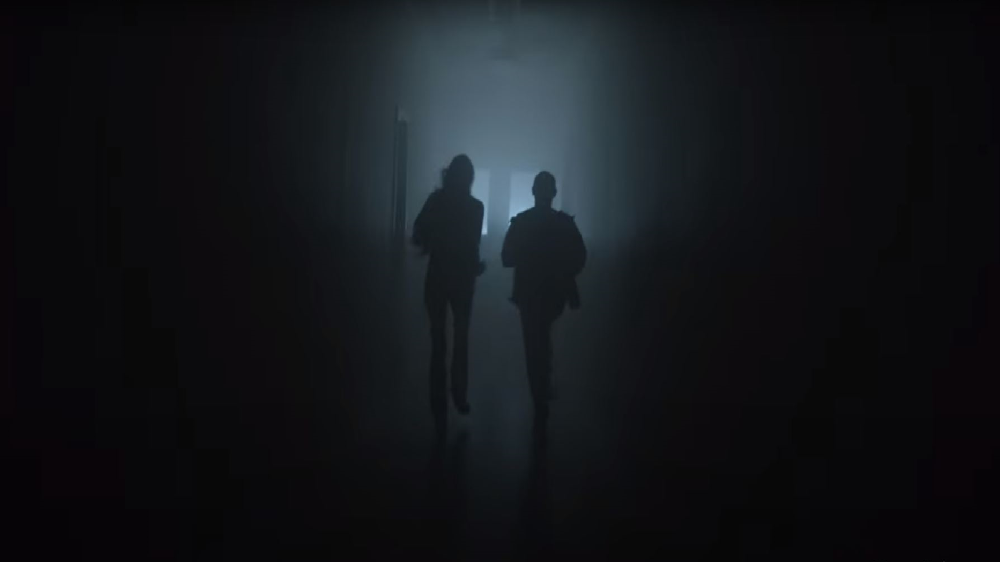

# 프로젝트명 : Mirroring (개발자 : 김태랑, 윤홍인)

  

## [목차]
### 1. [컨셉](#1)
### 2. [관련 이미지 & 동영상](#2)
### 3. [대표 이미지](#3)
### 4. [컨셉 & 대표 이미지 기반 작품 묘사](#4)
### 5. [Mirroring 구성 요소](#5)
### 6. [게임 시스템 디자인](#6)
### 7. [게임 요구사항 & 흐름도](#7)
### 8. [스토리보드](#8)

***
  

## [컨셉]
### 메인컨셉 :: 불확실성

- 러브크래프트는 인간의 뇌가 불확실한 것에 대해 취약하다는 것을 알고 있었고 그는 "가장 오래되고 강력한 두려움은 미지의 것에 대한 두려움"이라고 말했습니다.
불확실성에 대한 공포가 인간이 경험하는 모든 공포의 근본적인 원인 이라는 것을 토대로 게임의 분위기를 형성하여 플레이어로 하여금 알 수 없는 불안감에서 오는 공포를 경험할 수 있는 게임을 제작하고자 합니다.

### 서브 컨셉 1 :: 정보

- 완벽하지 않은 정보는 때로 난항을 격게 만드는 원인이 되기도 합니다. 게임 진행에 중요하게 작용하는 스토리 혹은 기믹의 정보를 부분적으로만 플레이어에게 제공하여 메인 컨셉을 보조하는 역할을 할 것입니다.

### 서브 컨셉 2 :: 충격

- 게임 진행에 따라 알게 되는 게임의 스토리로 하여금 플레이어에게 새로운 충격을 주어 흥미를 유발할 수 있도록 할 것입니다.

### 서브 컨셉 3 :: 의미

- 플레이어가 불확실성에서 벗어나기 위해 수행하는 행동에 의미를 부여하여 게임의 분위기를 자연스럽게 형성할 수 있도록 할 것입니다.

### 서브 컨셉 4 :: 성찰

- 사회적 문제나 평소 도덕성과 이익의 갈등 등 다양한 문제들을 게임 속에 내포하여 플레이어로 하여금 스스로의 행동에 대해 성찰할 수 있는 기회를 제공할 것입니다.

### 서브 컨셉 5 :: 희열

- 플레이어가 문제를 해결했을 때, 희열을 느끼고 다음 챕터로 넘어갈 수 있는 원동력을 제공할 것입니다.

  

## [관련 이미지 & 동영상]

- 이미지  
  
- 동영상
  

  

## [대표 이미지]

  

## [컨셉 & 대표이미지 기반 작품묘사]

> ### 대표이미지 기반 : 전체적으로 어두운 분위기를 기본으로한 환경을 구상하고 있습니다.

> ### 컨셉 기반: 주인공은 떨어져 있는 종이가 한 장을 발견합니다. 그 종이에는 주인공, 윤원성, 최성민, 김수연의 이름이 적혀있고 주인공을 제외한 3명의 이름은 빨간 볼 팬으로 가위 표가 되어있었습니다.(서브컨셉_정보, 서브컨셉_충격, 서브컨셉_의미, 서브컨셉_성찰, 메인컨셉_불확실성) 침대 옆에 있는 창문을 보았습니다. 방 자체도 어둡고 바깥도 너무 어두워서 잘 안보이지만 밤인 것 같았습니다.(서브컨셉_정보, 서브컨셉_의미, 메인컨셉_불확실성) 창문과 침대 사이의 서랍 위에는 기괴한 피아노 건반 사진이 올려져 있습니다.(서브컨셉_정보, 서브컨셉_충격, 서브컨셉_의미, 메인컨셉_불확실성) 그리고 그 서랍은 열쇠로 잠겨 열리지 않습니다.(서브컨셉_정보) 창문 반대편에는 책상과 금고, 책장이 있습니다.(서브컨셉_정보) 책상 위에 작은 상자를 발견하고 상자를 열기 위해 비밀번호가 필요하다는 것을 알게 된 주인공은 단서를 찾습니다.(서브컨셉_정보, 서브컨셉_의미) 주변을 훑어보던 중 책상 서랍 안에 일기장의 한 페이지를 발견합니다. 그곳에는 고통스러운 일기가 적혀있었습니다.(서브컨셉_정보, 서브컨셉_충격, 서브컨셉_의미, 서브컨셉_성찰, 메인컨셉_불확실성) 다음은 책장을 확인해보니 주인공이 다녔던 고등학교의 2017년 졸업 앨범이 있었습니다.(서브컨셉_정보, 서브컨셉_의미) 졸업 앨범을 꺼내던 중 그 사이에서 학교의 전경 사진과 일기장의 일부분이 또 나왔습니다.(서브컨셉_정보, 서브컨셉_의미, 서브컨셉_희열) 이곳에도 마찬가지로 고통스러운 일기의 내용이 적혀있습니다.(서브컨셉_정보, 서브컨셉_충격, 서브컨셉_의미, 서브컨셉_성찰, 메인컨셉_불확실성) 하지만 아직 상자의 비밀번호를 알 수 있는 단서는 없는 것 같아서 주변에 아직 보지 않은 물건이 있는지 확인합니다.(서브컨셉_정보) 주인공은 문 옆에 커다란 액자를 발견하고 액자를 건드렸습니다.(서브컨셉_정보) 액자가 떨어지자 그 뒤에는 알 수 없는 문양이 있었습니다.(서브컨셉_정보, 서브컨셉_의미, 메인컨셉_불확실성) 주인공은 이 문양을 보고 피아노의 건반 사진이 떠올라 피아노 건반 사진에 쓰여있는 숫자와 문양의 모양을 맞추어 비밀번호(9608)를 입력합니다.(서브컨셉_정보, 서브컨셉_희열, 메인컨셉_불확실성) 비밀번호를 입력하니 책상 위에 상자가 열리고 그 안에서 작은 열쇠가 하나 나옵니다.(서브컨셉_정보,서브컨셉_희열, 메인컨셉_불확실성) 그 열쇠로 방안에 열쇠를 넣을 수 있는 구멍에 넣어 보던 중 침대 옆에 서랍이 열리게 되고 그 안에서 입학식 날에 관한 이야기가 쓰여있는 일기장을 발견합니다.(서브컨셉_정보, 서브컨셉_충격, 서브컨셉_의미, 서브컨셉_성찰, 서브컨셉_희열, 메인컨셉_불확실성) 책장의 졸업 앨범과 서랍 안의 입학식 일기를 본 주인공은 금고에 입학식 년도(2015)를 입력하자 금고가 열리고 그 안에 열쇠가 모습을 보였습니다.(서브컨셉_정보, 서브컨셉_의미, 서브컨셉_희열, 메인컨셉_불확실성) 주인공은 그 열쇠로 방문을 열어 다음 방으로 넘어갑니다.(서브컨셉_희열) 그리고 충격적인 사실을 알게 됩니다. 처음 침대 옆에 창문은 밖이 아니라 그림을 사이에 둔 창문이였고 그 반대편에는 첫 번째 방을 확인할 수 있는 공간(두 번째 방)이 있었던 것 이였습니다.(서브컨셉_정보, 서브컨셉_충격, 서브컨셉_의미, 메인컨셉_불확실성) 주인공은 두 번째 방을 탈출하기 위해 방을 훑어보던 중 창문 앞 책상 위에 나침반과 3이 세 번 적힌 종이 그리고 소파를 발견합니다.(서브컨셉_정보, 서브컨셉_의미, 메인컨셉_불확실성) 곧바로 소파에 가까이 가서 밀어보니 소파 밑에서 일기장의 일부분을 찾게 됩니다.(서브컨셉_정보, 서브컨셉_충격, 서브컨셉_의미,서브컨셉_성찰, 메인컨셉_불확실성) 그리고 일기장의 내용 중 “오른쪽”의 부분이 빨간색 볼 팬으로 쓰여져 있는 것을 본 주인공은 책상 위에 있는 나침반을 보고 동쪽 벽에 있는 책장을 옆으로 밀게 됩니다.(서브컨셉_정보, 서브컨셉_의미, 서브컨셉_희열, 메인컨셉_불확실성) 책장을 밀자 금고가 하나 나왔고 첫 번째 방에 있던 금고의 비밀번호가 입학식 년도(2015)였던 것을 떠올려 졸업식 년도(2017)를 입력합니다.(서브컨셉_정보, 서브컨셉_의미, 메인컨셉_불확실성) 그러자 금고의 문이 열리고 안에는 열쇠와 누군가에 의해 찢어진 신문의 일부분이 보입니다.(서브컨셉_정보, 서브컨셉_의미) 신문에 내용은 이러했습니다. “[사라진 4인방] 중앙 고등학교의 동문이었던 윤원성(24), 최성민(24), 김수연(24), 김홍준(24)이 행방불명된 것을 부모들의 신고로 알게 된 경찰 측은 즉각 수사에 나섰다. 2022년 4월 17일 경찰의 기자회견에 따르면 아직 피해자들의 행방은 알 수 없으며 행방불명이 된 기간으로 보아 살아있을 가능성이 아직 있어 수사의 속도를 내겠다고 밝혔다.”는 내용을 본 주인공은 지금에 상황이 왕따를 당한 피해자가 복수를 하는 상황임을 인지하게 됩니다.(서브컨셉_정보, 서브컨셉_충격, 서브컨셉_의미, 서브컨셉_성찰, 메인컨셉_불확실성) 주인공은 혼란스러운 감정을 추스르며 열쇠가 들어갈 구멍을 찾기 위해 다시 주변을 둘러보기 시작합니다.(서브컨셉_충격) 밀려져 있는 책장 옆에 작은 서랍을 발견한 주인공은 서랍에 열쇠를 넣어봅니다.(서브컨셉_희열) 열쇠가 열리고 서랍 안에는 알 수 없는 문제가 있었습니다. 문제의 내용은 이러했습니다. “중앙 고등학교에 아주 친한 4인방이 있었습니다. 그 4인방 중 1명은 사교성이 좋고 훤칠하여 많은 친구들에게 총애를 받았습니다. 그런데 어느 날 4인방 중 여자인 1명이 총애받는 친구를 좋아한다는 사실을 나머지 2명의 친구가 알아버렸습니다. 여자는 2명의 친구에게 놀림을 받고 화가나 반 친구에게 학교 운동장에 있는 나무에 열린 열매를 다 먹으라며 화풀이를 했습니다. 학교 운동장에는 과연 몇 그루의 나무가 있을까요?”(서브컨셉_정보, 서브컨셉_충격, 서브컨셉_의미, 서브컨셉_성찰, 메인컨셉_불확실성) 주인공은 첫 번째 방에 졸업 앨범에서 학교의 전경 사진이 떨어진 것을 기억하고 첫 번째 방으로 가 학교 운동장에 몇 그루의 나무가 있는지 세어보았습니다.(서브컨셉_정보, 서브컨셉_의미) 그리고 곧 바로 두 번째 방의 문으로 가서 한참을 고민하다가 책상 위의 3이 세 번 적힌 종이를 보고 비밀번호(9711)를 입력합니다. 강철로 된 문이 열리고 밖이 보입니다.(서브컨셉_성찰, 서브컨셉_희열, 메인컨셉_불확실성) 그리고 게임은 끝납니다.

  

## [<미러링> 구성 요소]

- 모든 일은 자신에게 되돌아 온다.

- 자료 : [게임 구성 요소 PDF](./pdf_data/게임구성요소.pdf)

 

## 1. 메커니즘

[도전 과제]

1. 모든 방의 문제를 해결하고 탈출하는 것.
2. 방에 흩어져 있는 정보로 주인공이 여기에 오게 된 이유를 파악하는 것.

[재미 요소]

1. 물체와의 상호작용 : 상호작용을 통하여 플레이어가 능동적으로 문제의 힌트
혹은 게임 스토리의 정보를 습득할 수 있도록 하여 탐색의 흥미를 자아냄.
2. 힌트 : 문제의 해결 방식을 유추할 수 있는 힌트 혹은 문제 자체를 힌트의 형식으로
제공하여 플레이어가 방안에 숨겨진 문제들을 찾고 해결할 수 있도록 함.
3. 문제 : 방을 탈출하기 위한 수단으로 하나의 문제를 여러 과정들로 분리하여
게임의 난이도를 높이고 사용자에게 게임의 몰입감을 제공함.
4. BGM 및 효과음 : 현실적인 사운드를 이용하여 사용자에게 현실감을 주어
게임 속 공간에 있는 것 같은 몰입감을 제공함.

 

## 2. 이야기

[만들게 된 배경]

개인주의적 성향이 유행하고 있는 현재 사회에서 개인주의와 이기주의를
혼동하여 살아가는 사람들이 많아지고 있고 개인주의와 이기주의의 측면으로
접근하지 않더라도 사회적 동물로써 상호관계 간 최소한의 배려 및 존중조차
하지 않는 잘못된 이념이 문제없이 적용되고 있는 단체들이 존재한다.
주변에서 흔하게 볼 수 있는 예시로써 왕따 문제가 있다.
우리는 게임을 통해 원활하고 완만한 인간관계가 서로 간의 존중과
배려에서 비롯하고 자신의 사소한 행동이 때로는 상대방에서 정신적,
신체적으로 크게 영향을 끼칠 수 있다는 경각심을 게임을 통해 상기시키고자
한다.

[참신함]

- 주변에서 실제로 일어나고 있는 사회적 문제를 주제로 하여
플레이어에게 문제의식을 상기시킴.

- 스스로의 행동에 대하여 성찰하는 기회를 제공하여
게임의 의미와 깊이를 더함

[카메라 관점]  

1. 1인칭 시점을 채택하여 플레이어에게 몰입감과 현실감을 제공함.
2. 화면 UI를 간소화하여 플레이어가 게임 속 상황에 몰입할 수 있는 환경을 제공함.
3. 좌측 상단에 플레이어가 획득한 아이템을 아이콘으로 보여주어 시각적으로 확인할 수 있도록 함.
4. 우측 상단에 플레이어의 도전과제를 볼 수 있는 버튼을 배치하여, 게임이 순조롭게 진행될 수 있도록 함

 

## 3. 미적요소

[디자인]

캐릭터 : 주변에서 볼 수 있는 건장한 20대 남성의 모델을 사용.
오브젝트 : 현실에 실제로 존재할 것 같은 디자인의 물건(책장, 탁자, 액자, 시계) 모델을 사용.
상호작용 : 물체들의 중력작용과 캐릭터의 움직임 등이 현실성 있게 작용하여 실제처럼 구현.

[컬러]

캐릭터 : 대한민국 20대 남성을 모티브로 하고 있으므로 살구색 피부의 검정머리 남성으로 구현.
오브젝트 및 주변환경 : 허름한 집, 정리가 안된 창고의 분위기를 자아내기 위해 어둡고 얼룩진 색상으로 표현.

[음향]  

캐릭터 : 걷거나 상호작용할 때, 무겁고 둔탁한 음향을 사용하여 으스스한 분위기 조성.
오브젝트 및 주변환경 : 바람이 새는 소리와 물건이 떨어지는 소리, 문이 천천히 열리는 소리 등 으스스한 분위기를 조성할 수 있는 음향을 활용.
 

## 4. 기술

1. 물체의 상호작용에 물리엔진을 적용하여 현실적인 물체의 움직임을 구현.
2. 음향의 싱크를 맞춰 캐릭터와 물체의 움직임에 현실성을 더함.
