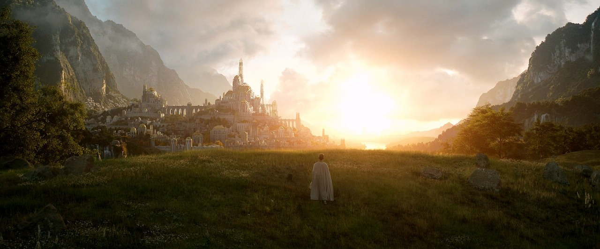

# 프로젝트명 : 붕괴된 마력의 정수 (개발 : 윤홍인)

  

## [목차]
### 1. [컨셉](#1)
### 2. [관련 컨셉 이미지](#2)
### 3. [대표 이미지](#3)
### 4. [작품 묘사](#4)
### 5. [Mirroring 구성 요소](#5)
### 6. [게임 시스템 디자인](#6)
### 7. [개발 요구사항 & 흐름도](#7)
### 8. [프로토타입 개발작업 일정](#8)

 

***

  

## [컨셉]
### 메인컨셉 :: 선택
- 단순히 주어진 스킬들을 사용하여 이루어지는 1차원적인 적과의 전투가 아닌 적 쓰러뜨리기 위해 플레이어가 사용할 수 있는 스킬들을 조합하여 강하게 공격하거나 스킬을 조합하지 않고 빠르게 여러 번 공격하는 등, 여러 방식으로 적을 처치할 수 있도록 하여 플레이어에게 주어진 다양한 경우의 수에서 가장 선호하고 원하는 방식을 직접 선택하여 게임을 진행할 수 있게끔 하고자 메인 컨셉을 "선택"으로 정하였습니다.

### 서브 컨셉 1 :: 다양성
- 사용하거나 조합하는 스킬의 종류, 마법 지팡이의 종류, 몬스터의 종류 등을 다양하게 구성하여 플레이어가 경험할 수 있는 플레이의 폭을 넓히고자 첫 번째 서브 컨셉을 "다양성"으로 정하였습니다.

### 서브 컨셉 2 :: 자유
- 플레이어는 적과의 전투, 게임의 진행에 있어서 방식이나 내용에 크게 구애받지 않고 플레이어가 원하는 방식으로 진행할 수 있게끔 하고자 두 번째 서브 컨셉을 "자유"로 정하였습니다.

### 서브 컨셉 3 :: 조합
- 앞써 말씀드린 다양한 스킬들과 마법 지팡이들 중 플레이어가 원하는 스킬과 장비를 자유롭게 선택하여 플레이하게끔 하고자 세 번째 서브 컨셉을 "조합"으로 정하였습니다.

  

## [관련 컨셉 이미지]

  

## [대표 이미지]

  

## [작품묘사]

> ### 시작 화면 :
> - 광활한 숲을 배경으로 공중에 보라색 크리스탈의 마력의 정수가 붕괴되고 있는 이미지를 채택하여, 게임의 컨셉인 자유와 장르인 어드벤쳐를 표현할 수 있도록 구상했습니다.
> - 좌측 하단에는 게임을 시작하는 버튼과 게임을 종료하는 버튼 그리고 설정 버튼을 두어 사용자의 선택에 의해 게임을 설정하거나 시작할 수 있도록 구상했습니다.

 

> ### 게임 화면 :
> - 전체적으로 UI를 최소화하여 사용자가 게임의 상황에 쉽게 몰입할 수 있는 환경을 조성하였습니다.
> - 좌측 단에 현재 플레이어 레벨과 플레이어가 소지한 재화를 확인할 수 있도록 UI를 배치하였습니다.
> - 'ESC'키를 이용하여 사용자 메뉴를 이용할 수 있도록 구상했습니다.
> - 마우스를 이용하여 플레이어 캐릭터의 시아를 변경하며, 'F'키를 이용해 사물 및 NPC와 상호작용 할 수 있습니다.

 

### 시나리오 :

> 어느 날 세계의 곳곳에서 마력의 균형을 유지하는 마력의 정수가 알 수 없는 원인으로 갑자기 붕괴하기 시작합니다.

> 이로 인해 마법의 위력이 비정상적으로 강해져 마물(몬스터)들이 활개를 치고, 마법의 영향을 받는 공간이 뒤틀리는 등, 다양한 문제가 발생하게 됩니다.

> 세계의 변두리, 작은 마을에서 마을 사람들을 도와주던 젊은 마법사 그리우스는 세계에 이상을 느끼고 원인을 알아내 문제를 해결하기위한 모험을 떠나게 됩니다.

> 난폭해진 마물들을 처치하여 위험에 노출된 마을들을 구하면서 원인을 찾던 중, 마력의 정수가 붕괴하기 시작한 원인에 연금술사들이 관여하고 있다는 것을 알게 됩니다.

> 그리우스가 마물들과 연금술사들을 처치하며, 마력의 정수에 가까워질수록 그의 앞을 막는 연금술사들이 더욱 강력해지고 많아졌습니다. 그는 강력한 연금술사들을 쓰러뜨리며, 마력의 정수를 하나씩 원래대로 되돌려 놓았습니다.

> 그리우스가 마지막 마력의 정수에 이르렀을 때, 그의 앞에 연금술사 협회장이 모습을 드러냈습니다. 그리고 연금술사 협회장이 기술 발전을 위해 마력의 정수를 이용하려고 했고 이로 인해 마력의 정수가 붕괴되기 시작했다는 것을 알게 되었습니다.

> 그리우스는 마력의 균형을 되돌리기 위해 연금술사 협회장을 쓰러뜨리고 마력의 정수를 되돌립니다. 세계는 다시 균형을 찾고 평화로워지며 게임은 끝을 맺습니다.

  

## [Mirroring의 구성 요소]
### 1. 메커니즘

[도전 과제]

1. 마을 주변 필드의 마물(몬스터)처치 및 마을 여관 퀘스트 클리어를 통하여 경험치와 재화 획득을 하여 상위 단계의 마법을 습득하고 강한 장비를 구매로 캐릭터 육성 및 스토리 진행.

2. 최종 보스를 클리어하고 마력의 정수 붕괴를 저지하며 게임 클리어.

[재미 요소]

1. 스토리 : 플레이어가 캐릭터를 육성하고 게임을 계속 진행해야 하는 이유와 동기를 부여함으로써 플레이어가 게임에 자발적으로 참여하게 만듦.

2. 필드(마을, 숲) : 스토리의 틀과 개연성을 제공하고 플레이어가 캐릭터를 육성하고 스토리를 직접 이끌어 나가는 공간으로 사용되어 게임과 스토리에 직접적으로 참여할 수 있도록 연결하는 장치로서 작용함.

3. 스킬 : 다양한 스킬들을 사용하거나 조합하고 새로운 스킬들을 얻어 마물(몬스터)을 처치할 수 있도록 하여 플레이어가 캐릭터를 육성하고 퀘스트를 클리어 하는데 있어서 흥미를 자아낼 수 있는 장치로서 작용함.

4. 아이템 : 플레이어가 스테이지를 클리어하는데 도움 혹은 기믹으로 작용하여, 단순한 게임플레이 방식에서 탈피하고 마물(몬스터)의 능력치로 게임 난이도를 조절하는 것이 아닌 기믹을 통해 난이도를 조절함으로써 스토리 진행에 플레이어가 더 직접적으로 참여하게 함.

 

### 2. 이야기

[만들게 된 배경]

- 어려서 멋있는 용사가 모험을 하여 세상을 구하는 판타지 이야기에 동경하였습니다.
하지만 사람들은 저마다 동경하는 용사의 이야기가 있고 저 또한 자기만의 용사 이야기가 있었으면 좋겠다고 생각했습니다.
본 게임을 플레이하는 사람들이 자기만의 영웅담을 스스로 써 내려갈 수 있으면 좋겠다고 생각해서 "붕괴된 마력의 정수"를 만들게 되었습니다.

[참신함]

- 대부분의 어드벤쳐 게임이 큰 틀의 스토리를 따라가면서 이야기가 진행될 때, 본 게임은 깊은 스토리가 없고 플레이어가 가고 싶은 방향으로 모험을 경험하면서 원하는 방식으로 캐릭터를 육성하면 된다는 점에서 참신하다고 말씀드릴 수 있습니다.

[카메라 관점]  

- 3인칭 시점을 채택하여 플레이어에게 넓은 시아와 편의성을 제공하였습니다.

- 화면 UI를 간소화하여 플레이어가 게임 속 상황에 몰입할 수 있는 환경을 제공함.

- 좌측 하단에 플레이어가 획득한 아이템을 아이콘으로 보여주어 시각적으로 확인할 수 있도록 함.

 

### 3. 미적요소

[디자인]

- 플레이어 캐릭터 : 작은 마을에서 사람들을 도와주는 젊은 마법사 컨셉.

- 논 플레이어 캐릭터 : 중세 판타지 세계관의 마을 및 스테이지 분위기에 맞는 의상을 입고 있는 평범한 인간 컨셉.

- 몬스터 : 액체 괴물, 돌로된 골램, 불을 뿜는 늑대 등 비현실적인 생물 컨셉.

- 오브젝트 : 중세의 목조 및 석재 건물과 포션, 마법과 같은 판타지 분위기 컨셉.

[컬러]

- 캐릭터 : 20대 남성의 마법사에 적절한 구리빛 피부와 탁한 갈색 톤의 의상.

- 오브젝트 및 주변환경 : 마을의 오브젝트 대부분이 목조 건물 오브젝트와 마차 등에 어울리는 갈색 톤의 색상.

[음향]  

- 캐릭터 : 스킬을 사용할 경우, 가볍고 빠른 것이 날아가는 듯한 소리.
플레이어 캐릭터가 움직일 경우, 짚신을 신고 낙엽을 밟는 걷는 소리.

- 오브젝트 및 주변환경 : 마을 안의 경우, 사람들이 웅성거리는 소리.
필드의 경우, 나무 사이로 바람이 지나는 소리나 나뭇잎이 흔들리는 소리, 새가 우는 소리.

  

## [게임 시스템 디자인]

### 1. 게임 오브젝트 분해

|번호|오브젝트 이름(영문이름)|
|:---:|:---:|
|1|주인공 (PlayerCharacter)|
|2|NPC (NPC)|
|3|마물 (Monster)|
|4|연금술사 (Alchemist)|
|5|마법 (Magic)|
|6|물약 (Potion)|
|7|마법 지팡이 (Wand)|

 

***

 

### 2. 플레이어 캐릭터 속성 (파라미터)

|속성|영문 명칭|설명|비고|
|:---:|:---:|:---:|:---:|
|레벨|Level|플레이어 캐릭터의 캐릭터 등급입니다.|높을 수록 공격력에 더 높은 추가 수치가 적용됩니다.|
|금화|Gold|게임에서 사용되는 재화이자 재화 단위입니다.|게임에서 아이템 혹은 장비를 거래할 때 사용됩니다.|
|체력|HealthPoint|플레이어 캐릭터의 생명력 수치입니다.|0이 될 경우, 주인공이 기절 하게됩니다.|
|마력|ManaPoint|플레이어 캐릭터의 스킬 가용 수치입니다.|0이 될 경우, 스킬을 사용할 수 없습니다.|
|공격력|AttackPoint|플레이어 캐릭터의 타격 수치입니다.|높을 수록 마물에게 더 강한 피해가 적용됩니다.|
|이동속도|Speed|플레이어 캐릭터의 이동 수치입니다.|높을 수록 더 빠르게 이동합니다.|

 

***

 

### 3. 오브젝트 속성 (파라미터)

#### 1) 오브젝트 이름 : NPC

|속성|영문 명칭|설명|비고|
|:---:|:---:|:---:|:---:|
|BasicNPC|BasicNPC|상호작용 시, 짧은 대사를 말합니다.||
|QuestNPC|QuestNPC|플레이어 캐릭터에게 퀘스트를 요청합니다.|퀘스트 성공 시, 재화와 경험치를 보상합니다.|
|DealerNPC|DealerNPC|플레이어 캐릭터와 거래를 합니다.|거래를 통해 재화를 얻거나 아이템을 구매할 수 있습니다.|

#### 2) 오브젝트 이름 : 마물 Monster

|속성|영문 명칭|설명|비고|
|:---:|:---:|:---:|:---:|
|속성|Property|타격에 영향을 주는 특성입니다.|물, 불, 공기, 흙, 전기가 있습니다.|
|체력|HealthPoint|플레이어 캐릭터의 생명력 수치입니다.|0이 될 경우, 처치 됩니다.|
|공격력|AttackPoint|몬스터의 타격 수치입니다.|높을 수록 주인공에게 더 강한 피해가 적용됩니다.|

#### 3) 오브젝트 이름 : 연금술사 Alchemist

|속성|영문 명칭|설명|비고|
|:---:|:---:|:---:|:---:|
|체력|HealthPoint|플레이어 캐릭터의 생명력 수치입니다.|0이 될 경우, 처치 됩니다.|
|공격력|AttackPoint|몬스터의 타격 수치입니다.|높을 수록 주인공에게 더 강한 피해가 적용됩니다.|

#### 4) 오브젝트 이름 : 마법 지팡이 Wand

|속성|영문 명칭|설명|비고|
|:---:|:---:|:---:|:---:|
|속성|Property|타격에 영향을 주는 특성입니다.|물, 불, 공기, 흙, 전기가 있습니다.|
|공격력|AttackPoint|몬스터의 타격 수치입니다.|높을 수록 주인공에게 더 강한 피해가 적용됩니다.|

#### 5) 오브젝트 이름 : 마법 Magic

|속성|영문 명칭|설명|비고|
|:---:|:---:|:---:|:---:|
|속성|Property|타격에 영향을 주는 특성입니다.|물, 불, 공기, 흙, 전기가 있습니다.|
|공격력|AttackPoint|몬스터의 타격 수치입니다.|높을 수록 주인공에게 더 강한 피해가 적용됩니다.|

#### 6) 오브젝트 이름 : 물약 Potion

|속성|영문 명칭|설명|비고|
|:---:|:---:|:---:|:---:|
|체력 포션|HP Potion|플레이어의 체력을 회복합니다.|체력을 10회복 합니다.|
|마력 포션|MP Potion|플레이어의 마력을 회복합니다.|마력을 10회복 합니다.|
|이속 포션|Speed Potion|플레이어의 이동속도를 증가합니다.|이동속도가 5%, 3분간 증가 합니다.|

 

***

 

### 4. 플레이어 캐릭터의 행동

|행동|영문 명칭|설명|
|:---:|:---:|:---:|
|앞으로 이동|Walk_Forward|플레이어 캐릭터를 앞으로 이동합니다.|
|뒤로 이동|Walk_Back|플레이어 캐릭터를 뒤로 이동합니다.|
|오른쪽으로 이동|Walk_Right|플레이어 캐릭터를 오른쪽으로 이동합니다.|
|왼쪽으로 이동|Walk_Left|플레이어 캐릭터를 왼쪽으로 이동합니다.|
|시아 변경|Looking|마우스를 이용하여 시아를 변경합니다.|
|상호작용 하기|Interaction|'F'키를 눌러 게임 오브젝트와 상호작용합니다.|
|인벤토리 활성/비활성|Inventory|'E'키를 눌러 인벤토리를 활성/비활성합니다.|
|근접 공격|Basic Attack|'C'키를 눌러 근접 공격을 합니다.|
|마법 공격|Magic Attack|마우스 좌 클릭을 통해 마법을 발동합니다.|
|마법 선택|Select Magic|마우스 휠을 통해 마법을 선택합니다.|
|마법 조합|Magic Combination|마우스 우 클릭을 통해 마법 조합을 활성/비활성합니다.|

 

***

 

### 5. 게임 오브젝트의 행동

#### 1) 오브젝트 이름 : NPC

|행동|영문 명칭|설명|
|:---:|:---:|:---:|
|퀘스트 수락|Quest Accept|플레이어가 퀘스트를 수락합니다.|
|퀘스트 완료|Quest Complete|플레이어에게 보상을 지급합니다.|
|아이템 구매|Buy Item|플레이어가 아이템을 구매합니다.|
|아이템 판매|Sell Item|플레이어가 아이템을 판매합니다.|

#### 2) 오브젝트 이름 : 마물 Monster

|행동|영문 명칭|설명|
|:---:|:---:|:---:|
|순찰|Patrol|필드 영역을 순찰합니다.|
|추격|Chase|플레이어 캐릭터를 발견하고 추격합니다.|
|공격|Attack|공격 범위 안에 있는 플레이어를 공격합니다.|

#### 3) 오브젝트 이름 : 연금술사 Alchemist

|행동|영문 명칭|설명|
|:---:|:---:|:---:|
|순찰|Patrol|필드 영역을 순찰합니다.|
|추격|Chase|플레이어 캐릭터를 발견하고 추격합니다.|
|공격|Attack|공격 범위 안에 있는 플레이어를 공격합니다.|

#### 4) 오브젝트 이름 : 마법 지팡이 Wand

|행동|영문 명칭|설명|
|:---:|:---:|:---:|
|착용|Hold|플레이어가 지팡이의 효과를 받습니다.|

#### 5) 오브젝트 이름 : 마법 Magic

|행동|영문 명칭|설명|
|:---:|:---:|:---:|
|타격|Attack|마물에 타격을 성공하여 체력을 줄입니다.|

#### 6) 오브젝트 이름 : 물약 Potion

|행동|영문 명칭|설명|
|:---:|:---:|:---:|
|사용|Use|플레이어가 물약의 효과를 받습니다.|

 

***

 

### 8. 게임의 규칙

#### 1) 핵심 규칙

- 마을 주변 필드의 마물(몬스터)처치 및 마을 여관 퀘스트 클리어를 통하여 경험치와 재화 획득을 하여 상위 단계의 마법을 습득하고 강한 장비를 구매로 캐릭터 육성 및 스토리 진행합니다.
- 필드를 모험하며 마력의 정수가 붕괴하는 이유를 탐색하고 마력의 정수가 붕괴된 이유를 밝혀 마력의 정수 붕괴를 저지합니다.

#### 2) 보조 규칙

- 스킬을 사용하여 마물들을 처치하여 플레이어 레벨을 올리고 재화를 획득합니다.
- NPC와 상호작용하여 퀘스트를 수행하여 플레이어 레벨을 올리고 재화를 획득합니다.
- NPC와 상호작용하여 더 좋은 장비와 스킬을 획득하여 플레이어 캐릭터를 육성합니다.
- 필드를 모험하여 더 강한 마물들이 있는 마을로 이동합니다.
- 필드에 있는 단서들을 통해 마력의 정수가 붕괴되는 이유를 알아냅니다.

 

***

 

### 9. 게임에서 사용될 공식

- 플레이어는 'W', 'A', 'S', 'D'키를 통하여 캐릭터를 이동 시킬 수 있습니다.
- 플레이어는 마우스를 통하여 캐릭터의 시아를 조정할 수 있습니다.
- 플레이어는 'F'키를 통하여 NPC와 상호작용 할 수 있습니다.
- 플레이어는 'E'키를 통하여 인벤토리를 활성화 및 비활성화할 수 있습니다.
- 플레이어는 마우스 좌 클릭을 통하여 마법 스킬을 사용할 수 있습니다.
- 플레이어는 마우스 휠을 통하여 마법 스킬을 선택할 수 있습니다.
- 플레이어는 마우스 우 클릭을 통하여 마법 조합을 활성화 및 비활성화할 수 있습니다.
- 플레이어는 마법 공격을 통해 마물을 처치할 수 있습니다.

  

## [개발 요구사항 & 흐름도]

### 1. 요구사항

- 시작화면, 게임화면으로 총 2개의 화면으로 구성되어 있습니다.
- 시작화면에는 대표 이미지와 화면 중앙에 게임의 타이틀이 적혀 있고 좌측 하단에는 게임을 시작하는 버튼과 게임을 종료하는 버튼 그리고 설정 버튼이 있습니다.
- 메뉴화면에는 게임 설정 버튼과 게임저장 버튼, 게임종료으로 총 3개의 버튼으로 구성되어 있습니다.
- 메뉴화면에서 게임종료 버튼을 누를 경우, 게임이 종료됩니다.
- 메뉴화면에서 게임저장 버튼을 누를 경우, 현재까지 진행하였던 게임이 저장되어 게임을 재실행하였을 때, 저장한 스테이지부터 다시시작할 수 있습니다.
- 메뉴화면에서 설정 버튼을 누를 경우, 게임 설정 창이 활성화 됩니다.
- 설정화면에는 게임 내에서 나오는 소리의 음량을 조절할 수 있는 슬라이더가 있습니다.
- 설정화면에서 음량 조절 슬라이더를 움직일 경우, 게임 내에서 나오는 소리의 음량을 조절할 수 있습니다.
- 메뉴화면이 활성화 되어있는 상태에서 'Esc'키를 누를 경우, 메뉴화면이 비활성화 되고 원래의 화면으로 돌아갑니다.
- 게임화면에는 좌측 상단에 플레이어 레벨과 소유 재화가 표시됩니다.
- 게임화면에는 우측 상단에 현재 수행 중인 퀘스트가 표시됩니다.
- 게임화면에는 좌측 하단에 마법 스킬 사용을 위한 UI가 표시됩니다.
- 플레이어는 게임화면에서 ''W, 'A', 'S', 'D'키를 이용하여 플레이어 캐릭터를 조종할 수 있습니다.
- 플레이어는 게임화면에서 마우스를 이용하여 플레이어 캐릭터의 시아를 조종할 수 있습니다.
- 플레이어는 NPC 상호작용 범위 안에 들어올 경우, "F키로 상호작용" 문구가 화면에 표시됩니다.
- 플레이어는 NPC 상호작용 범위 안에서 'F'키를 누르는 것으로 NPC와 상호작용할 수 있습니다.
- 플레이어는 BasicNPC에게 상호작용 하는 것으로 BasicNPC의 대사를 확인할 수 있습니다.
- 플레이어는 QuestNPC에게 퀘스트를 받는 것으로 퀘스트를 수행할 수 있습니다.
- 플레이어는 퀘스트 완료 후 QuestNPC와 상호작용하여 퀘스트 보상을 받을 수 있습니다.
- 플레이어는 DealerNPC에게 아이템을 구매하는 것으로 포션 및 장비를 획득할 수 있습니다.
- 플레이어는 DealerNPC에게 아이템을 판매하는 것으로 재화를 획득할 수 있습니다.
- 플레이어는 게임 화면에서 'E'키로 인벤토리를 활성화 및 비활성화 할 수 있습니다.
- 플레이어는 활성화 된 인벤토리 내의 아이템 UI에서 사용 버튼을 눌러 아이템을 사용할 수 있습니다.
- 플레이어는 활성화 된 인벤토리 내의 장비 아이템 UI에서 해제 버튼을 눌러 아이템 사용을 해제할 수 있습니다.
- 플레이어는 마우스 좌 클릭을 통하여 마법 스킬을 사용할 수 있습니다.
- 플레이어는 마우스 휠을 통하여 마법 스킬을 선택할 수 있습니다.
- 플레이어는 마우스 우 클릭을 통하여 마법 조합을 활성화 및 비활성화할 수 있습니다.
- 플레이어는 마법 공격을 통해 마물을 처치할 수 있습니다.
- 스테이지를 클리어 하여도 플레이어는 이전 스테이지로 언제든 돌아올 수 있습니다.
- 마지막 스테이지를 클리어하면 엔딩 크레딧이 재생되고 시작화면으로 돌아옵니다.
- 게임의 환경 광원 효과를 설정 및 조정합니다.
- 광원 오브젝트 설정 값을 조정 및 수정합니다.
- 게임 오브젝트의 광 반사 효과를 설정 및 조정합니다.
- 추가적인 게임 광원 효과 및 기능을 구현합니다.
- 플레이어 오브젝트의 입력 음향을 설정 및 조정합니다.
- 게임 오브젝트의 출력 음향을 설정 및 조정합니다.
- 주변 사람들에게 게임을 배포하여 플레이해보고 받은 피드백을 바탕으로 게임을 다듬습니다.
- 게임의 오류 수정 및 변경 사항 적용을 합니다.
- 피드백 내용 정리 및 수용을 합니다.
- 사람들에게 ProtoType을 플레이해보고 받은 피드백을 바탕으로 게임을 다듬습니다.
- ProtoType 제작을 마무리하고 오류 및 수정사항을 재검토합니다.
- 최종본 제작을 마무리하고 오류 및 수정사항을 재검토합니다.

  

## [프로토타입 개발작업 일정]

